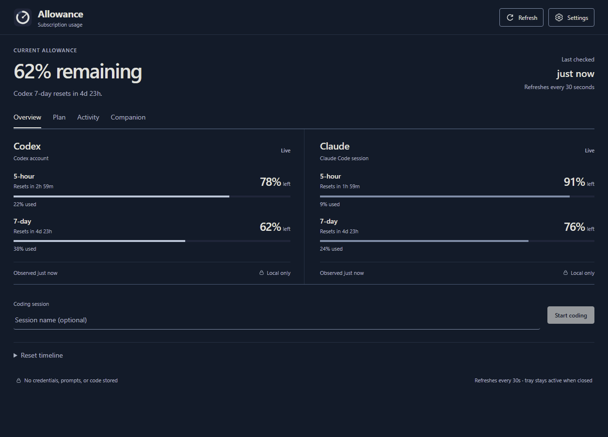

# Allowance

**Your Codex and Claude Code allowance, in one place.**

Allowance is a Windows tray app that shows your remaining subscription usage,
reset times, and local usage history. Check your capacity at a glance, plan a
coding session, and get a notification before you reach a limit.

[Download for Windows](https://github.com/calavera16/Allowance/releases/latest)
| [User guide](docs/USER_GUIDE.md)
| [Changelog](CHANGELOG.md)

*Example readings shown with demo data.*

## Install

Download a Windows x64 executable from the
[latest release](https://github.com/calavera16/Allowance/releases/latest):

| Download | Use |
| --- | --- |
| `Allowance-0.3.4-x64.exe` | Install Allowance with a setup wizard and Start menu shortcut. |
| `Allowance-Portable-0.3.4-x64.exe` | Run Allowance without installing it. Settings are still saved on your computer. |

Requires **Windows 10 or 11, x64**. Node.js is not needed to run either download.
Version 0.3.4 is unsigned, so Windows may show an unknown-publisher or reputation
warning. The release includes `SHA256SUMS-0.3.4.txt` for verifying downloads.

## Get started

1. Install and sign in to [Codex CLI](https://developers.openai.com/codex/cli)
   and/or [Claude Code](https://code.claude.com/docs/en/overview) on Windows.
   You can track either provider or both.
2. Open Allowance and follow the connection check in setup.
3. For Claude, select **Install Claude hook** during setup, or open
   **Settings > Connections > Install local hook**. Confirm the change, then
   start or resume a Claude Code session so it can report usage.
4. Select **Refresh**. Closing the window keeps Allowance running in the tray;
   use the tray menu to quit.

Allowance uses your existing CLI sign-ins. It does not require an Allowance
account or a service API key. See the [user guide](docs/USER_GUIDE.md) for
connection troubleshooting and details about the Claude integration.

## Features

- **Usage at a glance.** Compare reported quota windows, remaining percentages,
  and reset countdowns. Distinguish live readings from last-known data.
- **Sessions and planning.** Name coding sessions, save receipts, set working
  days and an allowance reserve, and explore estimates based on recent usage.
- **Local activity history.** Review charts, a 90-day heatmap, and session
  details. Export history to CSV or back up your profiles as JSON.
- **Tray and notifications.** Check a compact popup, configure usage thresholds,
  reset reminders and quiet hours, and optionally launch at Windows sign-in.
- **Desktop overlay.** Keep a small usage display on top of other windows. Add
  a built-in companion or your own GIF, with size, opacity and animation controls.
- **Personal preferences.** Separate local profiles, high contrast, reduced
  motion, and keyboard controls for positioning and resizing the overlay.

## Understanding the numbers

The main remaining percentage reflects the most restrictive fresh quota window.
Its reset countdown belongs to that same window. Stale readings stay visible
for reference and are excluded from current totals, alerts, and planning.

Forecasts are estimates based on observations. Session receipts measure
account-wide quota changes during a session, including activity from other
tools. Profiles separate local history and preferences; they do not switch
CLI accounts. Allowance tracks subscription allowance, not API billing.

## Privacy

Usage history, profiles, settings, and companion images stay on your computer.
Allowance sends no usage telemetry and leaves authentication with the CLIs.
The Codex fallback reads local session logs to extract quota events; it does
not retain prompts, transcripts, or source code in the usage model.

Backups can contain profile names, session names, history, and custom images.
Local data is not encrypted by Allowance. Read the
[security and privacy policy](SECURITY.md) before sharing diagnostics or exports.

## Updates and help

Version 0.3.4 uses manual updates. Download a newer release, export a backup from
**Settings > Data**, and quit Allowance from the tray before updating. Portable
users should remove the local Claude hook before deleting Allowance permanently.

For connection issues, start with **Settings > Health > Recheck** and the
[troubleshooting guide](docs/USER_GUIDE.md#troubleshooting). Report bugs or
request features through [GitHub Issues](https://github.com/calavera16/Allowance/issues).
Include the app version and steps to reproduce; keep personal backups and
credentials out of public reports. Report vulnerabilities through the
[security policy](SECURITY.md#reporting-a-vulnerability).

## Development

Built with Electron, React, and TypeScript. See the
[development guide](docs/DEVELOPMENT.md) for local setup, tests, and Windows packaging.

## License

[MIT](LICENSE). Allowance is an independent project and is not affiliated with
OpenAI or Anthropic.
