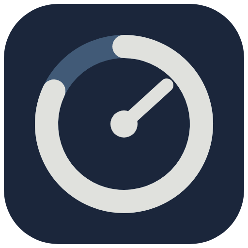

# Allowance

Allowance is a private Windows tray dashboard for Codex and Claude Code
subscription usage. Version 0.3 adds coding sessions, provider suggestions,
workday budgets, interactive forecasts, a usage heatmap, a reset timeline,
and animated desktop companions to the existing dashboard and tray overlay.
Version 0.3.1 adds custom GIF companions with size and animation controls.

Version 0.3.4 is the unpublished release candidate. It simplifies navigation,
consolidates the navy/slate design, adds saved-data recovery, makes session
controls reliable during refreshes, and adds safe Claude hook removal.
See [CHANGELOG.md](CHANGELOG.md) for changes and [RELEASING.md](RELEASING.md)
for the GitHub preparation and signing procedure. Preparing a build does not
publish a release.

## Features

- Every reported quota window, reset countdown, and Codex credit balance
- Named coding sessions with live usage and saved receipts
- Provider suggestions using available capacity, pace, and each window's reset
- Daily workday budgets with a configurable allowance reserve
- Interactive light/normal/heavy usage scenarios with observed pace ranges
- Clickable 90-day usage heatmap with per-window totals and session details
- Combined 24-hour / 7-day provider reset timeline
- Optional cat, robot, or plant companion that reacts to usage and resets
- Import your own GIF companion, with animation, transparency, size controls,
  and a still-frame option
- Burn-rate forecasts that estimate whether allowance will last until reset
- Native alerts at 70%, 80%, and/or 90% used
- Optional reset reminders, spike alerts, and quiet hours
- Local 7-, 30-, and 90-day charts with peak-hour statistics
- Separate local profiles for personal/work history and preferences
- First-run dependency and connection checks
- Claude Code status-line hook installation, update and removal with native confirmation
- Color-coded system tray icon and compact tray popup
- Optional always-on-top overlay with live Codex and Claude percentages
- Window-responsive typography and layout for notebooks through wide monitors
- Configurable refresh interval and launch-at-Windows-sign-in
- JSON backup/restore and CSV history export
- Redacted connection-health report and local snapshot inspector
- Automatic-update support for publisher-configured release channels
- NSIS installer and portable Windows executable targets
- High-contrast and reduced-motion support

## Interface design

The [navy/slate palette](https://coolors.co/palette/0d1b2a-1b263b-415a77-778da9-e0e1dd)
sets the mood: deep navy surfaces, slate controls, and off-white text. Typography,
space, and divider rules establish hierarchy. Provider readings and planning
information sit in open sections; the main action has the strongest contrast.
Statuses use explicit text, and charts distinguish providers with solid and
dashed lines. Muted warm colors indicate actual warnings or errors.

Avoid meaningless status dots, colored side stripes, a card around every piece
of information, decorative gradients or glows, emoji navigation, and competing
neon accents. **Overview** prioritizes quota comparisons, session controls and a
collapsed reset timeline. **Plan**, **Activity** and **Companion** have separate
views. The visual rules live together in `src/styles.css`.

UI smoke tests save synthetic-data previews in `release/smoke/`, including
`design-dashboard.png`, `design-settings.png`, `usage-compact.png`, and
`plan-narrow.png`.

The app logo comes from `assets/icon.svg`, shared by the dashboard, compact view,
and setup. Run `npm run icons` after changing the vector to regenerate the Windows
PNG and multi-size ICO. The Settings button uses a gear and a visible label;
provider headings use their names without improvised brand symbols. The main
reading says **remaining**, while **reserve** refers to the planning preference.

## Manage profiles

Open **Settings → Profiles** to create, rename, switch, or delete a profile.
Names are entered directly in Settings, with blank and duplicate names caught
before saving. Deletion has a separate confirmation. The header switcher appears
when there are two or more profiles; active coding sessions prevent creating,
switching, or deleting profiles until the session is finished.

Settings includes **Connections**, **Planning** and **Companion** controls. It
opens to **General**, saves preferences automatically, and keeps its
navigation and close control visible while the content scrolls. The setup wizard
shows progress, supports **Skip setup** and Escape, and keeps keyboard focus
inside each step. Relaunch it from **Settings ? Connections**. UI smoke checks also
cover profile validation, cancellation, session safeguards, and small windows.

## Position and customize the overlay

Enable the overlay from **Settings → General** or the tray menu. It starts
locked and click-through so it cannot interfere with the app underneath.

1. Select **Edit position and size** in Settings or
   **Edit overlay position and size** in the tray.
2. Drag the overlay using the edit bar.
3. Resize it from any window edge or corner. Keyboard users can Tab to the
   move bar or a resize handle, then use the arrow keys (10 pixels per press;
   hold Shift for 40 pixels).
4. Change opacity from 20% to 100% using either opacity slider.
5. Select **Done** or **Finish editing overlay** to lock it and restore
   click-through behavior.

Position, dimensions, opacity, and lock state are stored locally and restored
after restart. The reset action returns the overlay to the top-right of the
monitor and its default size.

## Plan your coding day

Open **Plan** from the workspace navigation. Choose your
working days and how much allowance to reserve. The daily budget divides the
remaining spendable allowance in each provider's longest daily/weekly window
across the remaining working dates, including today when selected. It is a
planning guide; it does not enforce limits or switch tools.

Select **Start coding** to begin an optionally named session and **Finish
session** to save a receipt in **Activity**. Sessions survive app restarts.
Keep Allowance running in the tray for continuous observations. A receipt
measures account-wide quota changes during that time, including usage in
other tools; it does not attribute usage to a repository or read your code.
Each quota window is listed separately in percentage points (pp).

The scenario slider models continuous use at 0.5–2 times your recent pace.
It needs at least 15 minutes of comparable observations. After four measured
15-minute intervals it also shows a range derived from recent pace variation.
Every window is compared with its own reset, and stale data is not used for
recommendations. These are estimates, not provider guarantees.

**Activity** contains a 90-day heatmap. Choose a provider and quota window,
then click a day to see measured usage and tagged sessions. New detailed
tracking begins with this version; existing percentage history stays intact.
Resets, missing intervals longer than 15 minutes, and midnight-crossing daily
intervals are excluded from usage totals and marked partial.

Open **Companion**, choose **Cat**, **Robot**, or **Plant**, and enable
**Show desktop overlay**. The companion rests at low allowance, wakes for a
detected reset, and respects the system's reduced-motion preference. Choose
**Off** to keep the regular overlay.

For your own character, click **Choose GIF** under **Desktop companion**. The app
automatically selects **Custom GIF** and shows a preview. Enable **Show desktop
overlay**, adjust **Overlay size**, and use **Play animation** to play or pause
it. The size percentage scales with the overlay window and fits the available
space as you resize it. **Replace GIF** chooses another file; **Remove GIF** clears your selection.
GIFs retain their original animation and aspect ratio. They do not change
characters in response to allowance levels. Reduced-motion settings show a
still frame automatically.

Imports accept GIF files up to 20 MB and 2048 × 2048 pixels. Image bytes are
copied into the app's local IndexedDB storage, separately from usage history,
so moving the original file does not affect your companion. JSON backups
include the selected GIFs (up to 40 MB of image data; 64 MB total backup).
Removed or replaced images may remain in the local image cache; backups only
include images referenced by your profiles.

## What it reads

- **Codex:** the documented codex app-server JSON-RPC method
  account/rateLimits/read. If app-server is unavailable, Allowance falls back
  to the newest timestamped rate-limit event among up to 20 recently modified
  files in %USERPROFILE%\\.codex\\sessions and labels it as a local snapshot.
  It streams those files locally; changing a file's modification time does not
  make an old observation fresh.
- **Claude Code:** the custom status-line JSON. The in-app setup button installs
  a small PowerShell status-line script in %USERPROFILE%\\.claude that keeps
  only recognized quota fields, a validated Claude Code version, and an observation timestamp.

Allowance leaves credentials with the CLIs. Its fallback reads local session
logs to extract quota events, but does not retain prompts, transcripts, or
source code in the usage data model. Profiles and history are stored per Windows user
in Electron local storage. A profile does not switch CLI credentials; users
continue to sign in and switch accounts through Codex or Claude Code itself.

Missing or future observation times, snapshots older than 15 minutes, and
balances whose reset has passed are excluded from current totals, history
recording, alerts, and planning. Provider cards keep these readings visible as
last known values. The total's reset belongs to the same window as its minimum
remaining allowance. Refresh or resume the relevant CLI session for new data.

## Requirements

- Windows 10 or newer, x64
- Codex CLI installed and signed in for Codex tracking
- Claude Code installed for Claude tracking
- Node.js 22.17 or newer only when developing or packaging

## Development

~~~powershell
npm ci
Copy-Item .env.example .env
npm run dev
~~~

npm start builds the web assets and launches them directly in Electron.
Closing the main window keeps Allowance in the system tray.

## Connect Claude Code

Open **Settings ? Connections** (or first-run setup) and select **Install local
hook**. A native confirmation appears before any Claude settings change. The
installer preserves unrelated settings, keeps the first
`settings.json.allowance.backup` and refreshes `settings.json.allowance.latest.backup`,
then writes the script and settings through atomic file replacements.
Malformed settings remain untouched with an actionable diagnostic. An unrelated
status line is never overwritten.

Select **Remove hook** to disconnect. Removal deletes only Allowance's exact
status-line entry from the current settings and removes its owned script;
it never restores an entire old settings backup over newer preferences.
Settings backups stay local. Start or resume Claude Code after changing its
hook configuration.

The Windows uninstaller performs the same cleanup before removing the app;
updates skip that cleanup. Portable users should remove the hook in Settings
before deleting the executable. If automatic cleanup cannot read the Claude
settings, repair that JSON and try again. For manual recovery, back up the
current `.claude/settings.json`, remove only the `statusLine` property whose
command points to `.claude/allowance-statusline.ps1`, and remove that script.
Preserve every other current setting and any replacement status line.

## Saved-data recovery

If stored profiles are damaged or use an unsupported version, Allowance pauses
autosaving and shows a recovery notice. The original remains untouched. Export
it for inspection, select **Use recovery copy** when available, or restore a
valid exported backup. Using the local recovery copy preserves the damaged
original separately. Backup restoration lists the affected profile count and
requires confirmation, with **Cancel** focused by default.

A shared storage budget covers all profiles. On space pressure, older
observations are trimmed first, then older inactive receipts and daily totals
if necessary; settings, profiles and active sessions remain. A visible notice
explains trimming or failed writes. Export a backup before closing if saving
fails. Local recovery checkpoints are best-effort and do not replace exported
backups. Custom GIF storage is separate.

## Validate and package

~~~powershell
npm test
npm run test:ui
npm run test:security
npm run security:check
npm audit
npm run dist
~~~

The final two artifacts are written to release\\:

- Allowance-0.3.4-x64.exe — installable NSIS package
- Allowance-Portable-0.3.4-x64.exe — portable build

The UI smoke suites run hidden Electron windows with isolated temporary
storage, preview data, and synthetic IPC responses. They cover planning and
overlays plus stale data, reset matching, compact refresh failures, Settings
keyboard focus, and CSV export recovery. They never connect to CLI collectors. Screenshots
are saved in `release/smoke/`.

## Environment and release configuration

Allowance reads usage from already signed-in local CLI tools. It does not need
OpenAI or Anthropic API keys. The optional `.env` is read by the desktop
launcher; existing shell variables take precedence. Only `.env.example` belongs
in Git. Environment files, signing certificates, logs, exports and personal
snapshots are excluded from the source export and packaged application.
No environment variables are automatically exposed to the renderer.

Update checks are disabled by default. A publisher can configure a public HTTPS
feed for signed release builds; an authenticated URL is rejected. Downloads
require an explicit restart/install action and do not install on ordinary quit.
See [RELEASING.md](RELEASING.md) for the public feed and signing configuration.
`npm run dist` always uses `--publish never`; `npm run dist:signed` also requires
code signing and fails instead of silently producing an unsigned release.

Security boundaries and the limits of local storage are documented in
[SECURITY.md](SECURITY.md). Do not attach personal backups to public issues.

## Data behavior

- Polling defaults to 30 seconds and can be set from 15 seconds to 2 minutes.
- A Claude snapshot older than 15 minutes is marked stale.
- History records at most every five minutes unless usage changes.
- History retention is capped at 90 days and about 26,000 points per profile,
  subject to the shared storage budget (900,000 UTF-16 code units before checkpoints).
- Planning retains 90 daily aggregates, 300 session receipts, and up to 600
  observations per quota window (at most 48 hours, 16 windows per profile).
- JSON backups include budgets, companions, detailed observations, and sessions;
  older v2 backups import with defaults for the new features.
- Custom GIFs persist across restarts and are included in JSON backups. GIF
  selection, animation preference, and display size are separate per profile.
- Notifications are deduplicated for each usage window/reset cycle.
- Import validates a versioned Allowance backup and asks before replacing data.
- Collector processes are tracked and their process trees stopped on completion,
  timeout and app quit. Fallback traversal skips symbolic links and is bounded.
- Redacted recent errors are available in **Settings ? Health**. Local logs in
  `%LOCALAPPDATA%\Allowance\logs` rotate at 256 KiB, retaining one previous file.

Organization API token/cost reporting remains separate because it requires
administrator credentials and represents API spend rather than subscription
allowance.
